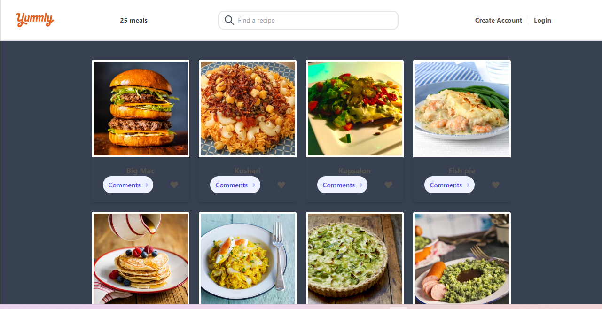
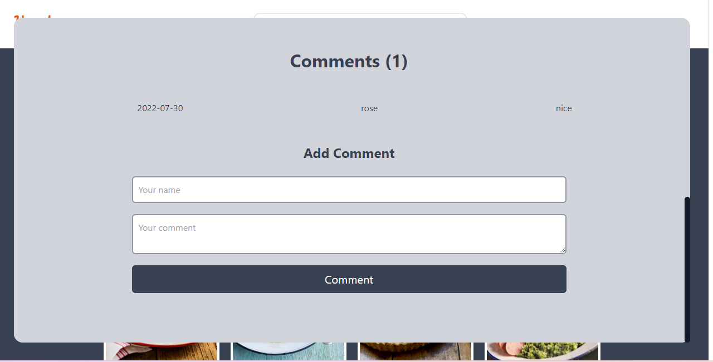

# Project Name

  yousRoz-Restaurant

# 📜 Description the project.
Javascript capstone project.
The JavaScript capstone project is about building web application based on an external API.
We selected an API that provides data about a topic that we like and then build the webapp around itI used API

## 🏛 Built With

- HTML
- CSS
- JavaScript
- ES6 Modules
- API 
- Webpak-config.
- following linters standards.
- following github flows standards.
- following git flows standards.

### 🖥️LIVE DEMO
You can use this project live by clicking [Live Demo]( https://roseokpe.github.io/yousRoz-Restaurant/)

Click [Video](https://drive.google.com/file/d/1K165NVfBZVrWSycqnOe4d7_tDxj8_tbc/view?usp=sharing) to see our video presentation of this project

## 📑 Authors

👤 **Ahmed Zaki Yousufi**
- GitHub: [Ahmed Zaki Yousufi](https://github.com/zakiyousufi)
- LinkedIn: [Ahmed Zaki Yousufi](https://www.linkedin.com/in/ahmadzaki-yousufi-055214217/)

👤 **Rose Okpe**
- GitHub: [@roseokpe](https://github.com/roseokpe)
- Twitter: [@roseokpe](https://twitter.com/roseokpe)
- LinkedIn: [LinkedIn](linkedin.com/in/rose-okpe-0334b5177/)

## ⚙ Getting Started

To get a local copy up and running... 
Follow these seteps

To get a local copy up and running follow these simple example steps.For SSH:git@github.com:Roseokpe/yousRoz-Restaurant.git For https:https://github.com/Roseokpe/yousRoz-Restaurant.git

Install
Run npm install after cloning the repo.

Usage
Run npm start for development. Run npm run build for production.

Run tests
Run npx eslint . for JS check
Run npx eslint . --fix to fix JS errors if found
Run npx stylelint "**/*.{css,scss}" for CSS check
Run npx stylelint "**/*.{css,scss}" --fix to fix CSS errors if found.

### 🔌Usage

>open your directory /yousRoz-Restaurant
to run the file :
_use vs-code or any IDE  to view line code .

_use your preferd browser to run the file .html to get project website.

## 🤝 Contributing

Contributions, issues, and feature requests are welcome!
thanks:

## 🙏🏻 Show your support

Give a ⭐️ if you like this project!

## 📝 License

This project is [MIT](./MIT.md) licensed.
